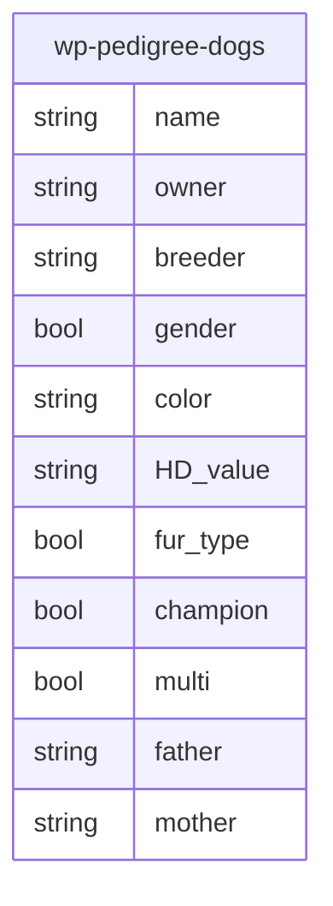

# Table schema

The table for the pedigree would be something like this:

## Description of the fields

- Name: The full name of the dog (with kennel)
- Owner: The current owner of the dog
- Breeder: The breeder of the dog
- Gender: Female (1) or Male (0)
- Color: The color of the fur
- HD: The HD values of the dog (Hip dysplasia)
- Fur type: The type of the fur (short hair (1) or long hair (0))
- Champion: Is the dog a champion? (Yes (1) or No (0))
- Multi Champion: Is the dog a multichampion? (Yes (1) or No (0))
- Father: Father of the dog
- Mother: Mother of the dog
